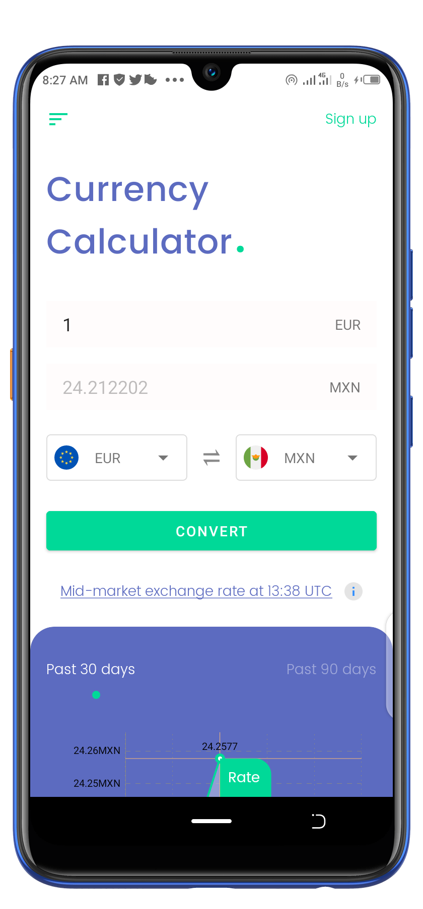
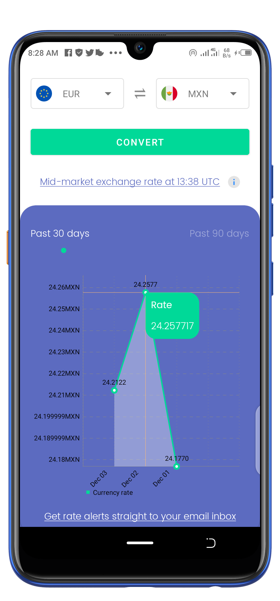
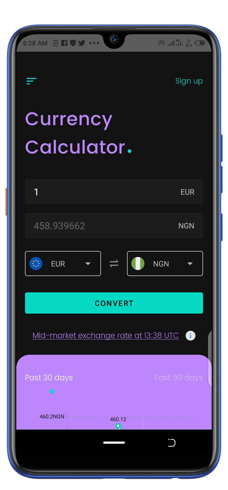
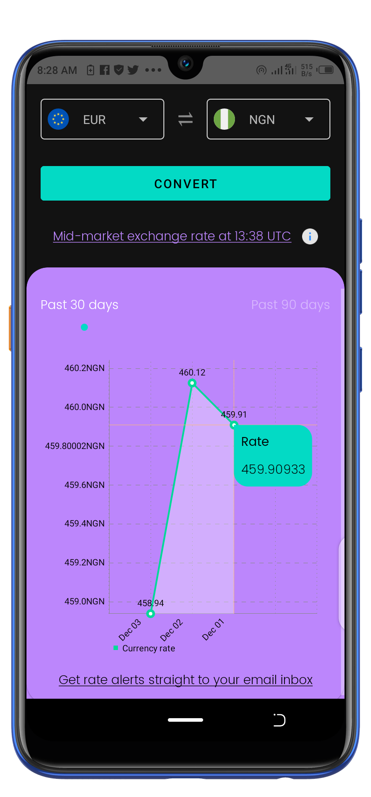

# Currency Calculator

    

This sample App allows you to calculate currency rate, and also displays a chart of currency rates for the past 30 or 90 days.

##### Currency Converter API used: [http://fixer.io](https://fixer.io/)

- App follows system settings and may startup in dark mode when installed on Android 10 or when battery saver is enabled on lower Android versions.

#### There are some known limitations on the app. for instance the base currency is set to Eur, this is because of the limitation on the data.fixer free account. A lot more could be done, but there are a lot of limitations on the free Api usage

## Features

* Kotlin Coroutines with Flow and Livedata
* Model View View-Model (MVVM) Architecture
* Jetpack Navigation
* Offline Usage
* Dagger Hilt
* Day and Night Mode

## Libraries

* [Data Binding](https://developer.android.com/topic/libraries/data-binding)
* [Dagger Hilt](https://dagger.dev/hilt)
* [Room Database](https://developer.android.com/training/data-storage/room)
* [Kotlin Coroutines](https://github.com/Kotlin/kotlinx.coroutines)
* [ViewModel](https://developer.android.com/topic/libraries/architecture/viewmodel)
* [Retrofit](https://square.github.io/retrofit/)
* [GSON](https://github.com/google/gson)
* [Mp Chart](https://github.com/PhilJay/MPAndroidChart)
* [Leak Canary](https://square.github.io/leakcanary/)

<h2 align="left">Screenshots</h2>
<h4 align="center">

 

 

## Author
Etoka Kingsley
